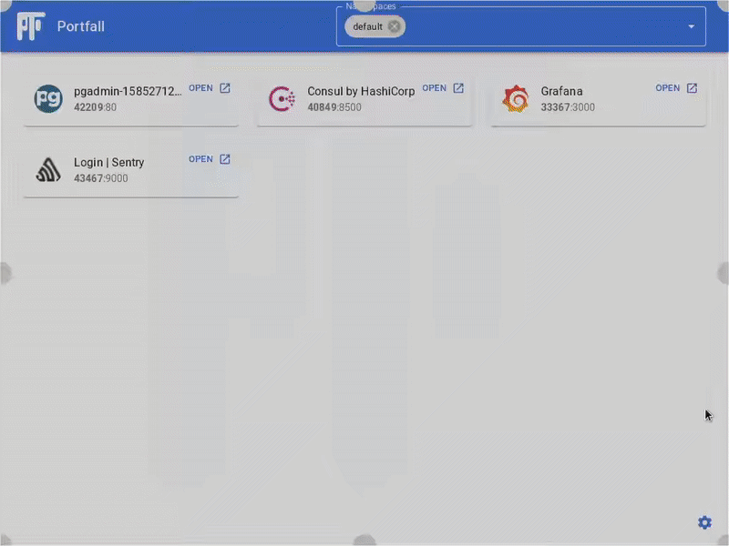

# Portfall

<p align="center">
  A desktop k8s port-forwarding portal for easy access to all your cluster UIs
  <br/><br/>
  <a href="https://goreportcard.com/report/github.com/rekon-oss/portfall"></a>
  <a href="https://www.codefactor.io/repository/github/rekon-oss/portfall"></a>
  <a href="https://github.com/rekon-oss/portfall/blob/master/LICENSE"></a>
  <a href="https://app.fossa.com/projects/git%2Bgithub.com%2Frekon-oss%2Fportfall?ref=badge_shield" alt="FOSSA Status"></a>
  <a href="https://github.com/rekon-oss/portfall/issues"></a>
  <a href="https://build.snapcraft.io/user/rekon-oss/portfall" alt="Snap Status"> </a>
  
  
  
</p>

## Demo
<p align="center">

</p>

## Installation

### [MacOS](https://github.com/rekon-oss/portfall/releases/latest/download/Portfall.dmg), [Windows](https://github.com/rekon-oss/portfall/releases/latest/download/Portfall.exe)
### Linux
#### Use the [AppImage](https://github.com/rekon-oss/portfall/releases/latest/download/Portfall-x86_64.AppImage)
Recommend installing [appimaged](https://github.com/AppImage/appimaged) to integrate portfall properly with your system.
```bash
wget "https://github.com/AppImage/appimaged/releases/download/continuous/appimaged-x86_64.AppImage"
chmod a+x appimaged-x86_64.AppImage
./appimaged-x86_64.AppImage --install
```

#### Build from source
```bash
git clone https://github.com/rekon-oss/portfall
cd portfall
# see build requirements for wails here https://github.com/wailsapp/wails#installation
# you will also need go and npm available
go get -u github.com/wailsapp/wails/cmd/wails
wails build
```
#### Snap coming soon!
Classic confinement requested [here](https://forum.snapcraft.io/t/classic-confinement-request-for-portfall/16520) 

## Technical details

Portfall uses **Go** to do all the Kubernetes work and **React** + **Material UI** for the frontend work.
This is glued together as a single binary with native rendering by the fantastic 
[Wails](https://github.com/wailsapp/wails) framework.

You can read more about it in my blog post here: 
https://rekon.uk/2020/04/portfall-a-desktop-k8s-port-forwarding-portal-for-easy-access-to-all-your-cluster-uis/

## License
[](https://app.fossa.io/projects/git%2Bgithub.com%2Frekon-oss%2Fportfall?ref=badge_large)
